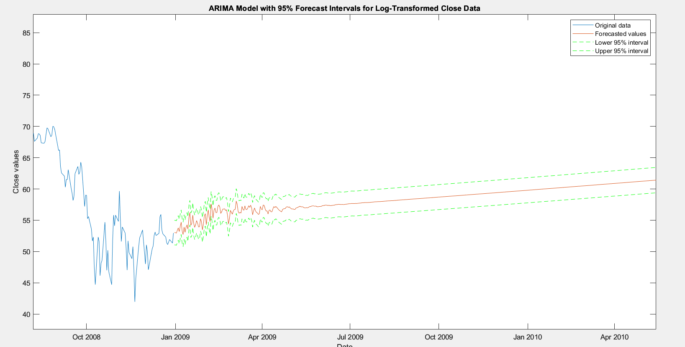
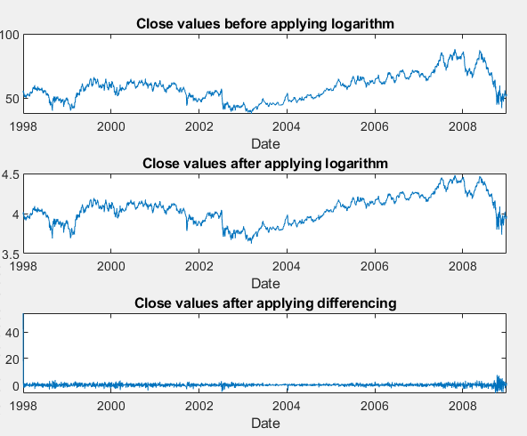
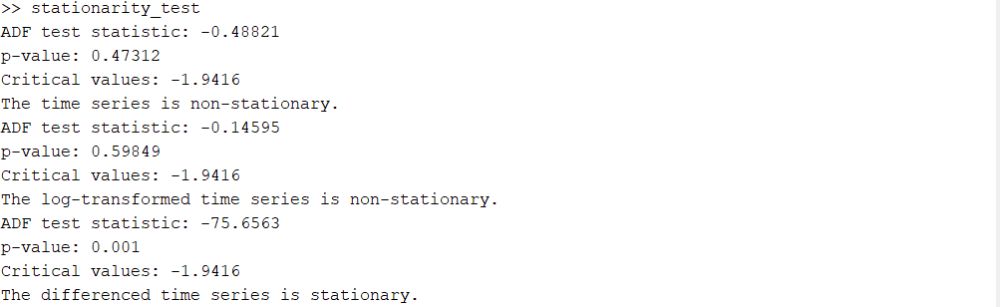
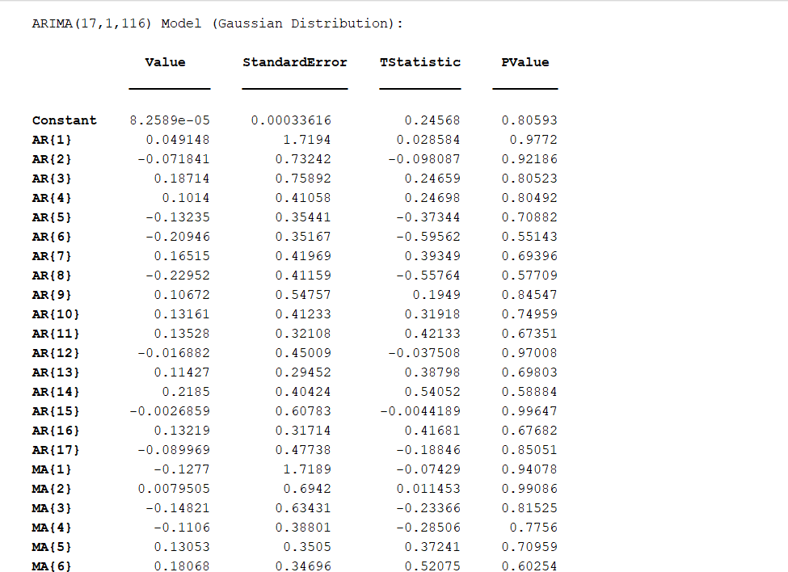
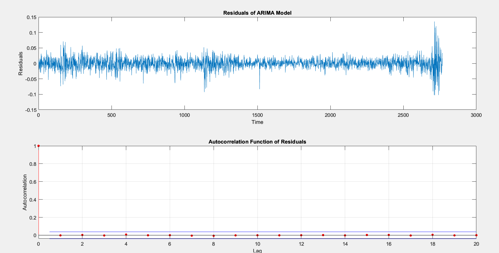

# ARIMA-AutoRegressive-Integrated-Moving-Average-Box-Jenkins-applied-to-Colse-data
Ljung-Box test |  Model identification | Parameters estimation | Diagnostic checking | Forecasting

This MATLAB project focuses on Close Data Forecasting using the ARIMA (AutoRegressive Integrated Moving Average) model. ARIMA is a widely used time series forecasting method that encompasses autoregression, differencing, and moving average components.

## Stationarity Testing

The provided code snippet demonstrates the process of stationarity testing using the Augmented Dickey-Fuller (ADF) test. Stationarity is a crucial assumption for time series analysis, including ARIMA modeling. The ADF test helps determine if a time series is stationary or not by analyzing its unit root.

### Code Explanation:

The code snippet performs the following steps:

1. **Loading Data**: Reads in a time series of daily closing stock prices from a CSV file.

2. **Original Time Series Plot**: Plots the original time series of closing stock prices.

3. **Augmented Dickey-Fuller (ADF) Test**: Conducts the ADF test on the original time series to assess stationarity.

4. **Logarithmic Transformation**: Applies a natural logarithm transformation to the closing stock prices.

5. **Log-Transformed Time Series Plot**: Plots the log-transformed time series.

6. **ADF Test on Log-Transformed Series**: Conducts the ADF test on the log-transformed time series.

7. **Differencing**: Calculates the first-order difference of the closing stock prices.

8. **Differenced Time Series Plot**: Plots the differenced time series.

9. **ADF Test on Differenced Series**: Conducts the ADF test on the differenced time series.

The results of the ADF test are displayed, indicating whether each transformation resulted in a stationary or non-stationary time series.

## Finding P and Q Orders for ARIMA Model

The provided MATLAB script `P_Q_finder.m` automates the process of determining the optimal P and Q orders for the ARIMA (AutoRegressive Integrated Moving Average) model based on the AIC (Akaike Information Criterion) and BIC (Bayesian Information Criterion) values.

### Script Explanation:

The script performs the following steps:

1. **Loading Data**: Reads in a time series of daily closing stock prices from a CSV file.

2. **Define Range of Possible Values for P and Q**: Initializes a range of possible values for the autoregressive (AR) order (P) and the moving average (MA) order (Q).

3. **Estimate ARMA Models**: Estimates ARIMA models for each combination of P and Q values and computes the AIC and BIC values.

4. **Select Optimal P and Q Orders**: Determines the P and Q values with the lowest AIC and BIC values, indicating the best-fitting ARIMA model.

5. **Display Results**: Outputs the best P and Q values based on both AIC and BIC criteria.

### Usage:

1. Ensure MATLAB is installed on your system.
2. Place your time series data in a CSV file named `Shel.csv`.
3. Copy and run the provided MATLAB script `P_Q_finder.m` to find the optimal P and Q orders for the ARIMA model.

### Note:
### Results of P Q I finding

- The optimal P and Q orders are crucial parameters for building an accurate ARIMA model for forecasting.

- Experiment with different ranges of P and Q values to fine-tune the model based on your specific data and forecasting requirements.

We chose the value of d as 1 because the differencing parameter d in an ARIMA model is
significant in determining the number of times that the time series needs to be differenced to achieve
stationarity. Stationarity is a fundamental assumption of many time series analysis techniques,
including ARIMA models. To determine the values of p and q for the ARIMA model, we used
the Bayesian Information Criterion (BIC) and Akaike Information Criterion (AIC) to measure the
goodness of fit of the model while taking into account the number of parameters used to estimate
the model.
The BIC and AIC are information criteria that balance the fit of the model with the complexity
of the model. The BIC penalizes models with more parameters more heavily than the AIC. The
lower the BIC or AIC value, the better the model fit.
We tried different combinations of p and q values and calculated the corresponding BIC and
AIC values for each model. We chose the values of p and q that resulted in the lowest BIC and
AIC values, as these values indicate the best balance between model fit and complexity.
After applying this algorithm, we found that the optimal values for p and q were 17 and 116,
respectively. These values were chosen based on the lowest BIC and AIC values obtained from
fitting ARIMA models with different combinations of p and q values.

## Diagnostic Checking

Once the parameters of the ARIMA model have been estimated, it's essential to check the goodness-of-fit of the model by examining the residuals. Diagnostic checks help ensure that the residuals exhibit characteristics of white noise, indicating that the model adequately captures the underlying patterns in the time series data.

### Ljung-Box Test for Residual Autocorrelation

The Ljung-Box test is a statistical test used to assess residual autocorrelation at different lags. The `lbqtest` function in MATLAB is commonly employed for this purpose. Here's how the test is interpreted:

- **Null Hypothesis**: There is no autocorrelation in the residuals (i.e., the residuals are white noise).
- **Alternate Hypothesis**: There is significant autocorrelation in the residuals.

If the p-value of the Ljung-Box test is less than the significance level (e.g., 0.05), we reject the null hypothesis and conclude that the residuals exhibit significant autocorrelation.

### Interpretation of Results:

- If the Ljung-Box test result is "The residuals exhibit significant autocorrelation," it indicates that the ARIMA model does not adequately capture the autocorrelation structure in the time series data. This suggests that the residuals display systematic patterns or structures not accounted for by the model.

- If the Ljung-Box test result is "The residuals do not exhibit significant autocorrelation," it indicates that the ARIMA model effectively captures the autocorrelation structure in the time series data. The residuals are essentially random and do not display systematic patterns or structures.

### Usage:

1. Once the ARIMA model parameters are estimated and the residuals are obtained, use the `lbqtest` function in MATLAB to perform the Ljung-Box test for residual autocorrelation.
2. Interpret the p-value of the test to determine if the residuals exhibit significant autocorrelation.
3. Based on the test result, assess the adequacy of the ARIMA model in capturing the autocorrelation structure of the time series data.

### Results 
Our model produced a non-significant Ljung-Box test result, which suggests that the ARIMA
model adequately captures the autocorrelation structure in the time series data. This means that
the residuals are effectively random and do not exhibit any systematic patterns or structures. As a
result, we can be more confident in the model’s ability to provide reliable forecasts for
future values.

## Forecasting

After estimating the parameters of the ARIMA model and ensuring its adequacy through diagnostic checks, the final step is to perform forecasting using the `forecast` function in MATLAB. Forecasting allows us to predict future values of the time series based on the estimated model.

By performing forecasting, we can use the estimated ARIMA model to generate predictions for
future values of the time series. This can be useful for making informed decisions or planning based
on expected future trends or patterns in the data.
